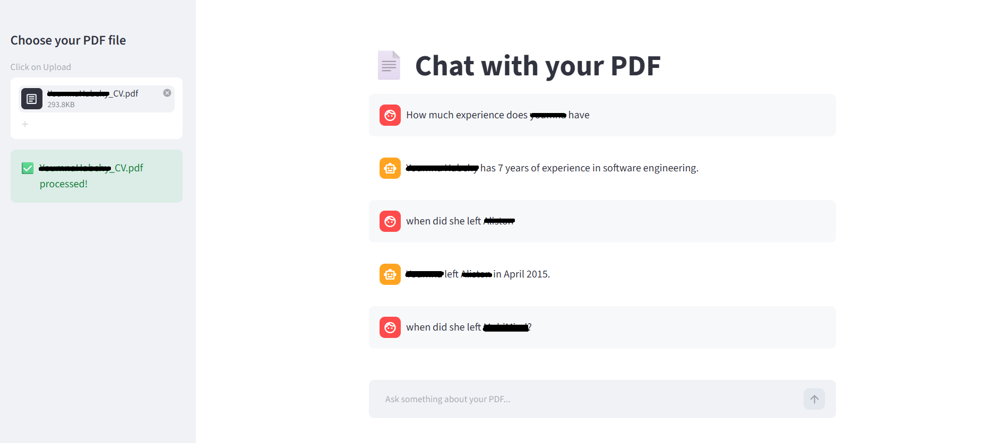

# RAG PDF Chatbot

A conversational AI chatbot that lets you upload any PDF and ask questions about it.
Built with LangChain, OpenAI, ChromaDB, and Streamlit.

## Features
- Upload any PDF document
- Ask questions in natural language
- Get answers with source citations
- Conversation memory across questions

## Tech Stack
- Python 3.14
- LangChain 1.4.0
- OpenAI GPT-4o-mini
- ChromaDB (vector store)
- Streamlit (UI)

## Setup

1. Clone the repo
git clone https://github.com/youmnah/rag-pdf-chatbot.git

2. Install dependencies
pip install -r requirements.txt

3. Create your .env file
cp .env.example .env
Add your OpenAI API key to .env

4. Run the app
python -m streamlit run app.py

## How it works
1. Upload a PDF via the sidebar
2. The PDF is split into chunks and embedded using OpenAI embeddings
3. Chunks are stored in ChromaDB vector database
4. When you ask a question, the most relevant chunks are retrieved
5. GPT-4o-mini generates an answer based on those chunks

## Demo

## 🚀 Live Demo
👉 [Try it here](https://youmnah-rag-chatbot.streamlit.app)

> You'll need an OpenAI API key to use the demo. [Get one here](https://platform.openai.com/api-keys)